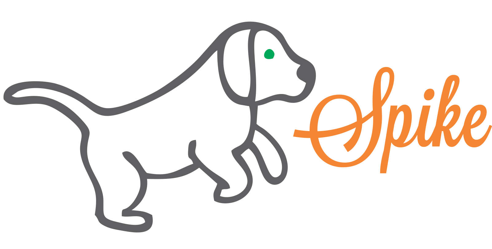

<p align="center"></p>

## Como instalar

> atenção é preciso ter o composer instalado

```
git clone git@github.com:AndreMart/cart-laravel.git

```

```
php artisan install

```

```
php artisan key:generate
```

<p> Crie sua base de dados</p>

<p> copie e cole o arquivo .env.example para .env</p>

<p> atribua os valores pertinentes</p>

```
DB_CONNECTION=mysql
DB_HOST=localhost
DB_PORT=SUA PORTA GERALMENTE 3306
DB_DATABASE=SUA BASE DE DADOS
DB_USERNAME=USUARIO
DB_PASSWORD=SENHA
```

<p> atualmente se utiliza mercado pago com Tokenizer</p>

<p> crie uma conta no mercado pago</p>

<p> pegue sua setAccessToken e adicione em CarrinhoController</p>

```
 SDK::setAccessToken("Aqui")
```

<p> Adicione em cart.blade sua  data-public-key</p>

```
 data-public-key="Aqui"
```
<p> O data-public-key e o setAccessToken são chaves passadas pelo mercado pago</p>

<p> após isso rode os seguintes comandos separadamente</p>

```
php artisan migrate
```

```
php artisan db:seed

```
<p> dados de entrada do sistema estão no arquivo /databases/seeds/UserTableSeeder </p>

```
php artisan serve

```
<p> url: 127.0.0.1 acesso ao front cliente </p>

<p> url: 127.0.0.1/admin acesso ao admin </p>

## Setup com Docker

> Caso use Mac ou Windows é preciso ter o [Docker Desktop](https://www.docker.com/products/docker-desktop) instalado (se usa Linux acesse este [link](https://docs.docker.com/install/linux/docker-ce/ubuntu/) para maiores informações).

Copie e cole o arquivo .env.example para .env

Acesse a pasta raiz do projeto:

```
cd /spike

```
Suba os serviços com o comando:

```
docker-compose up

```
Serão criados dois containers:

* **mercado-pago-mysql:** contém o MySql
* **mercado-pago-app:** contém os arquivos da aplicação

E dois serviços:

* **app:** serviço da aplicação
* **mysql:** serviço do MySql

Em outro terminal acesse a pasta raiz e execute os comandos abaixo:

```
# instalando as dependências:
docker-compose run app composer install

# gerando a chave:
docker-compose run app php artisan key:generate

# executando as migrates:
docker-compose run app php artisan migrate

# executando as seeds:
docker-compose run app php artisan db:seeds

```

Acesse a aplicação pela url [http://localhost](http://localhost)

Para parar os serviços basta fazer:

```
docker-compose down

```
## Tarefas

<p> Adicione webbaners </p>

<p> adicione categorias </p>

<p> adicione produtos para as categorias pertinentes </p>

<p>by: André Martins</p>
